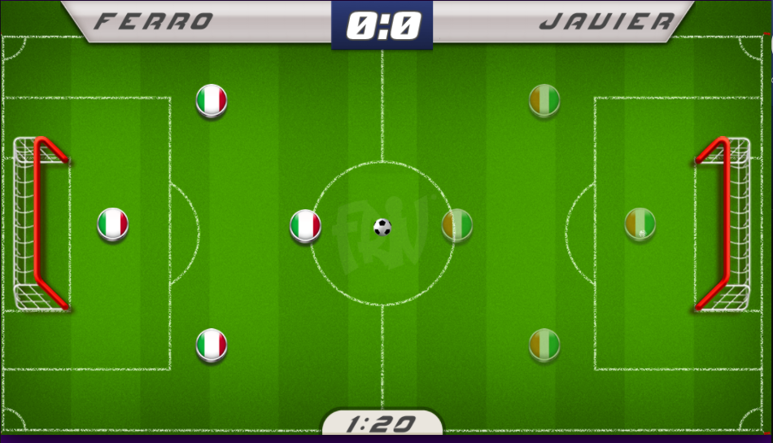

# Game Hockey
This game is inspired by https://www.friv.com/z/games/socceronline/game.html 
The goal is to implement this game in a major game called 'lan party'

# Initial screen
Choose your team (without name, the name will be the class attending)

# Basic AI system to play against the player

# Timer to manage the game

# Final score

# Points added to the team

# OPEN CODE

